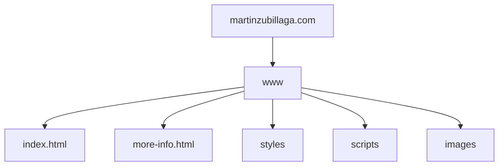

# martinzubillaga.com

### Martinzubillaga is a repository that feeds the website martinzubillaga.com

### This repository is the structure of the hosting. For the moment, the website is in the www folder, but there will be more websites in other folder working in the same hosting but in subdomains.

## It is made with

- HTML
- CSS
- JavaScript

### To see the principal page (www) click [here](https://martinzubillaga.com)

## Structure of the hosting:

